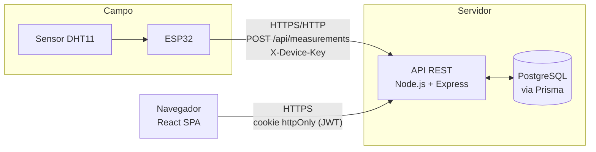
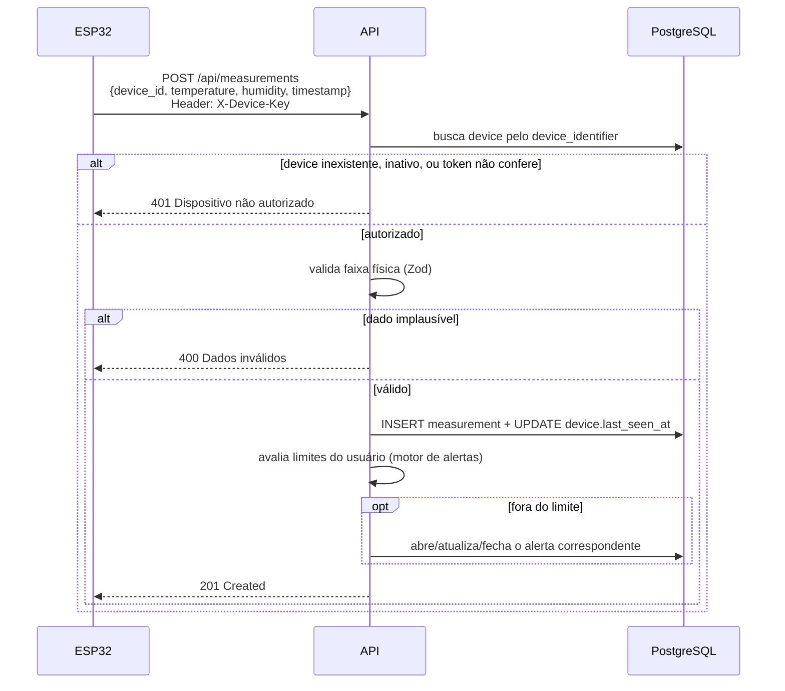
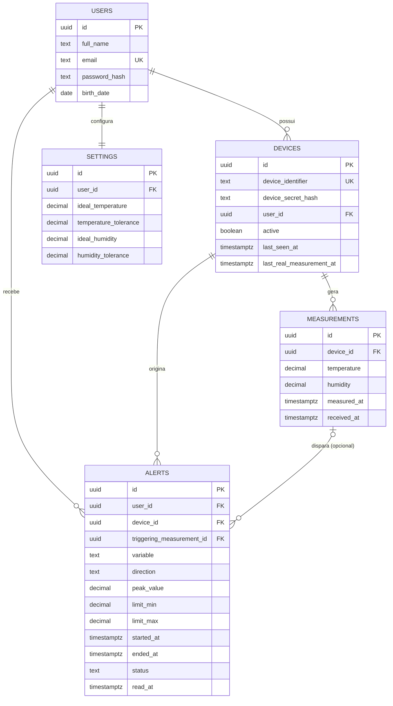
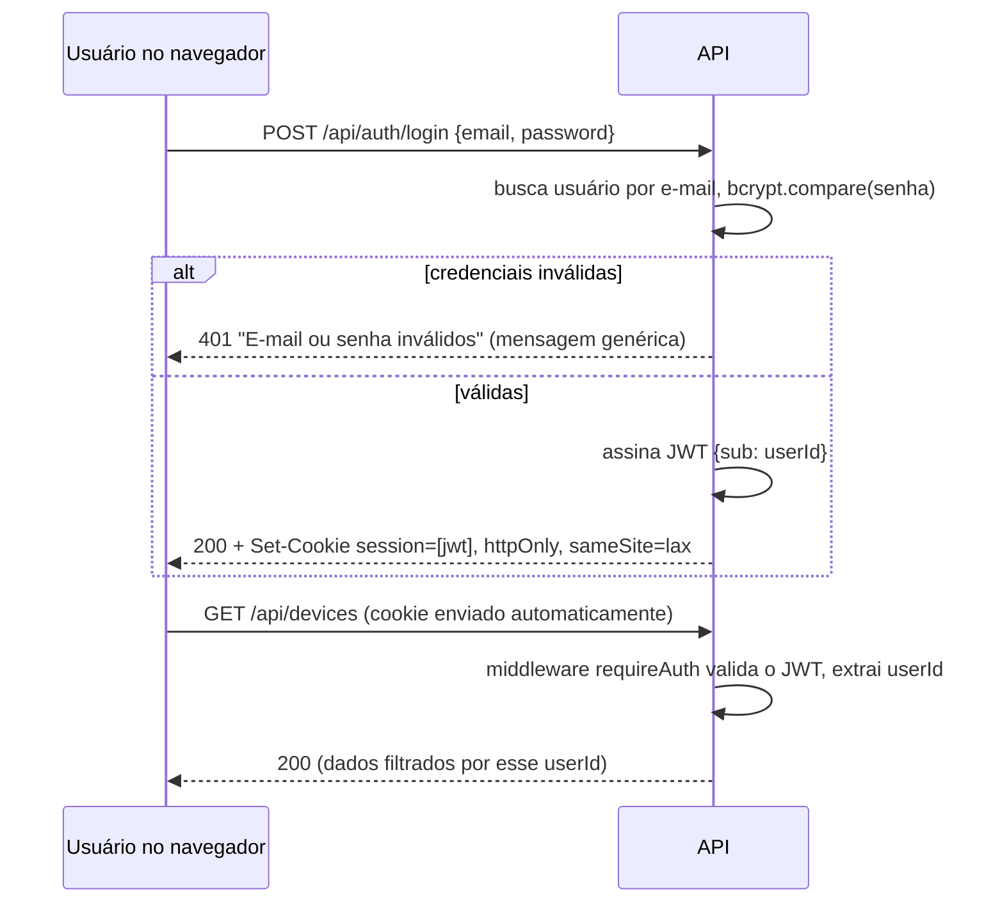
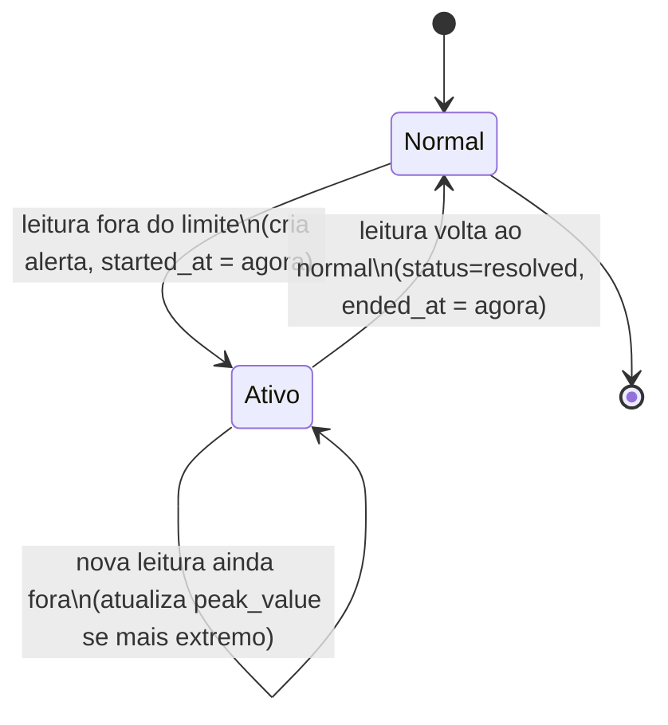

# Documentação Técnica — ThermoSense

> Documento de referência técnica do TCC, cobrindo objetivo, arquitetura, funcionamento
> de cada camada, segurança, instalação e testes. Complementa
> [`01-arquitetura-e-decisoes.md`](01-arquitetura-e-decisoes.md) (decisões e
> justificativas), [`02-integracao.md`](02-integracao.md) (verificação ponta a ponta) e
> [`03-seguranca.md`](03-seguranca.md) (revisão de segurança dedicada).

## 1. Objetivo do sistema

Permitir que um usuário cadastre uma conta, associe um dispositivo ESP32 equipado com um
sensor de temperatura/umidade, e acompanhe essas leituras remotamente por um sistema web:
valores atuais, histórico com gráficos, e alertas automáticos quando os valores saem de
uma faixa configurável — sem depender de acesso direto ao dispositivo ou de outra pessoa
observando o sensor fisicamente.

## 2. Arquitetura

Arquitetura em 3 camadas: o ESP32 fala **apenas** com a API REST (nunca com o banco
diretamente); a API é a única responsável por validar, processar e persistir dados; o
frontend consome a mesma API que qualquer outro cliente HTTP consumiria.



O ESP32 autentica-se com um **token de dispositivo** (não com a conta de um usuário); o
navegador autentica-se com a **sessão do usuário** (cookie JWT). Nenhum dos dois consegue
acessar dados fora do seu próprio escopo — detalhes na seção 8 (Autenticação).

## 3. Tecnologias utilizadas

| Camada | Tecnologia | Por quê |
|---|---|---|
| Frontend | React 18 + Vite | SPA reativa, build rápido, ecossistema maduro |
| Estilo | Tailwind CSS | Produtividade, responsivo por padrão |
| Gráficos | Chart.js (`react-chartjs-2`) | Leve, responsivo, API simples para linhas com filtro de período |
| Backend | Node.js + Express | Mesma linguagem (JS) em toda a aplicação web, fácil de rodar localmente |
| ORM | Prisma | Migrations declarativas, queries parametrizadas (proteção nativa contra SQL injection), client tipado |
| Banco | PostgreSQL 16 | `timestamptz` nativo (essencial para a estratégia de fuso horário), gratuito, robusto |
| Autenticação | JWT (`jsonwebtoken`) + `bcryptjs` | Sessão sem estado no servidor; hash de senha e de token de dispositivo |
| Validação | Zod | Schemas declarativos, mensagens de erro estruturadas |
| Firmware | Arduino Core para ESP32 | Padrão de fato para este microcontrolador; bibliotecas maduras (WiFi, HTTPClient, ArduinoJson, DHT) |

Justificativa completa de cada escolha (incluindo alternativas consideradas) em
[`01-arquitetura-e-decisoes.md`](01-arquitetura-e-decisoes.md#3-justificativa-das-escolhas).

## 4. Funcionamento do ESP32

O firmware (`esp32/firmware/firmware.ino`) segue este ciclo:

1. **Boot**: conecta ao Wi-Fi (com timeout) e sincroniza o relógio via NTP em UTC.
2. **Loop periódico** (a cada `READING_INTERVAL_MS`, configurável): lê o sensor DHT11
   através de uma camada de abstração (`src/Sensor.h`/`Sensor.cpp`) que isola a
   biblioteca específica do sensor do resto do firmware — trocar de sensor no futuro
   exige mexer só nesse arquivo.
3. A leitura é **validada localmente** (descarta NaN e valores fora de uma faixa
   plausível) antes de qualquer envio.
4. Se válida, monta um JSON (`device_id`, `temperature`, `humidity`, `timestamp`) e
   envia por `HTTPClient` com o header `X-Device-Key`.
5. Trata a resposta (sucesso, erro do servidor, falha de rede) sem travar — sempre volta
   ao loop e tenta de novo no próximo ciclo.
6. Se o Wi-Fi cair, tenta reconectar periodicamente (não bloqueia o restante do loop
   indefinidamente).

Detalhes de fiação, bibliotecas e configuração em [`esp32/README.md`](../esp32/README.md).

## 5. Comunicação ESP32 → API



O `device_id` sozinho nunca autentica — sempre exige o token no header `X-Device-Key`,
comparado por hash (nunca em texto puro) contra `devices.device_secret_hash`.

## 6. Funcionamento da API

API REST organizada em módulos por domínio (`auth`, `users`, `devices`, `measurements`,
`settings`, `alerts`, `history`), cada um com `routes.js` (rotas + validação) e
`service.js` (lógica de negócio + acesso ao Prisma). Lista completa de endpoints e
schemas em [`docs/openapi.yaml`](../backend/docs/openapi.yaml) (Swagger UI em
`/api/docs` com o servidor rodando).

Fluxo comum de uma requisição privada:
`middleware requireAuth` (valida JWT do cookie) → `validateBody`/`validateQuery`
(Zod) → `service` (sempre filtrando pelo `userId` do token, nunca do corpo da
requisição) → resposta serializada (nunca inclui `passwordHash`/`deviceSecretHash`).

## 7. Banco de dados

Modelo relacional normalizado com 5 entidades. Diagrama completo e justificativas de
modelagem (por que `alerts` é um evento, por que `device_secret_hash` em vez de token em
texto puro, por que `timestamptz`) em
[`01-arquitetura-e-decisoes.md`](01-arquitetura-e-decisoes.md#5-modelo-de-banco-de-dados).



Índices relevantes: `measurements(device_id, measured_at DESC)` (histórico/gráficos),
`alerts(user_id, status)` e `alerts(device_id, status)` (busca do alerta ativo e
contagem de não lidos).

## 8. Autenticação

Dois mecanismos independentes, cada um restrito ao seu próprio escopo:



- Senha: hash `bcrypt` (nunca texto puro), nunca serializada nas respostas.
- Sessão: JWT em cookie `httpOnly` (inacessível a JavaScript, mitigando XSS),
  `sameSite=lax`, `secure` em produção — nunca em `localStorage`.
- Erro de login: mensagem idêntica para e-mail inexistente e senha incorreta, para não
  permitir enumeração de contas.
- Toda rota privada usa `req.userId` (do token) para filtrar dados — nunca confia num
  `userId` vindo do corpo/query da requisição.

## 9. Sistema de alertas

Alertas são modelados como **eventos** (não uma linha por leitura fora do limite), para
não gerar notificações repetidas enquanto o sensor permanece fora da faixa:



Ao logar, o frontend consulta `GET /api/alerts/summary` (conta alertas com
`read_at IS NULL`, ativos ou já resolvidos) e mostra um banner "Você possui N
notificações desde seu último acesso" no Dashboard, além de uma bolinha vermelha com
essa contagem ao lado de "Notificações" no menu lateral (`Layout.jsx`, em polling a
cada 10s). O banner é só o aviso — a revisão em si acontece na tela dedicada
`/notifications` (menu "Notificações"), que lista os detalhes de cada anomalia
(variável, pico, limites, início/fim) e, ao ser aberta, chama `PATCH /api/alerts/:id/read`
para cada notificação ainda não lida. Ou seja, o simples ato de abrir a tela já "confere"
as notificações: elas somem do banner, da bolinha do menu e da própria tela a partir da
próxima visita, até a próxima anomalia. No resumo de outros dispositivos do Dashboard,
a mesma bolinha aparece ao lado de cada dispositivo com notificação pendente, com a
contagem quebrada por `device_id` (`GET /api/alerts` filtrado no cliente).

## 10. Gráficos

Dashboard e histórico usam Chart.js (via `react-chartjs-2`) com gráficos de linha para
temperatura e umidade. O eixo X usa rótulos de horário já formatados no fuso de São
Paulo (não uma escala de tempo contínua), porque o volume de pontos exibido é sempre
limitado pelo filtro de período aplicado na consulta à API (seção 11) — evita depender
de uma biblioteca adicional só para eixo temporal. Atualização a cada 10s por polling
(ver decisão na seção 24 do escopo, registrada em
[`01-arquitetura-e-decisoes.md`](01-arquitetura-e-decisoes.md#3-justificativa-das-escolhas)).

## 11. Histórico

`GET /api/history` aceita filtros (`deviceId`, `dateFrom`/`dateTo`,
`temperatureMin`/`Max`, `humidityMin`/`Max`, `status`) e pagina os resultados
(`page`/`pageSize`) — o backend nunca devolve a tabela inteira de uma vez. O status
(`normal`/`out_of_range`) de cada leitura é calculado no momento da consulta, contra as
configurações **atuais** do usuário (não um valor congelado por leitura).
`GET /api/history/export` gera CSV com os mesmos filtros, limitado a 5000 linhas.

## 12. Segurança

Ver [`03-seguranca.md`](03-seguranca.md) para a revisão dedicada (metodologia e
resultado). Resumo dos mecanismos implementados: hash de senha e de token de dispositivo
(bcrypt), JWT em cookie `httpOnly`, validação de todo input (Zod), queries sempre
parametrizadas (Prisma), CORS restrito, rate limiting em login/registro/ingestão de
medições, isolamento estrito entre usuários (404 em vez de 403), nenhum segredo
hardcoded (tudo via variáveis de ambiente).

## 13. Instalação

Ver [`README.md`](../README.md#instalação-e-execução) na raiz do repositório — passo a
passo de banco, backend, frontend e ESP32.

## 14. Configuração

Todas as variáveis de ambiente (backend, frontend) e de firmware (`config.h`) estão
documentadas em [`README.md`](../README.md#variáveis-de-ambiente) e nos respectivos
`.env.example`/`config.example.h`. Nenhum valor real é commitado.

## 15. Execução

```bash
# Backend (a partir de backend/)
npm run dev      # http://localhost:3000, com reload automático

# Frontend (a partir de frontend/)
npm run dev      # http://localhost:5173
```

Com ambos rodando e `CORS_ORIGIN`/`VITE_API_URL` configurados um para o outro, o fluxo
completo (cadastro → login → dashboard → alertas → histórico) funciona no navegador.

## 16. Testes

54 testes automatizados (Jest + Supertest) contra um banco de teste real, cobrindo
cadastro, login, isolamento entre usuários, ingestão de medições, o motor de alertas
(incluindo a lógica anti-spam) e histórico — ver
[`backend/README.md`](../backend/README.md#testes-automatizados) para como rodar.
Testes end-to-end manuais (Playwright, navegador real) do fluxo completo do usuário
estão documentados como parte do processo de desenvolvimento (Etapas 4 e 6 do
histórico de commits do projeto).
